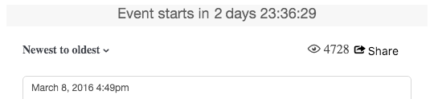

# CSS-Klassen formatieren{#storify-css-classes}

CSS-Klassen, die für Ihre Storify Apps verfügbar sind.

Verwenden Sie CSS, um Ihre Storify Apps für eine umfassendere Integration mit Ihrer Seite anzupassen, indem Sie einfach die Standard-CSS mit Ihrem eigenen Stylesheet überschreiben. In diesem Abschnitt werden verfügbare CSS-Anpassungen beschrieben.

## Autorenelemente {#section_tdy_hsh_xz}

Ermöglicht das Anpassen der Formatierung für den Autor, den Autor und den Zeitstempel des Beitrags.

| Class | Beschreibung |
|---|---|
| .s-author-name | Autor |
| .s-author-avatar | Der Avatar des Autors. |
| .s-img | Das Avatarbild des Autors. |
| .s-timestamp | Der Zeitstempel für das Datum, an dem der Inhalt gepostet wurde. |

## Kopfzeilenelemente {#section_nbv_gsh_xz}

Ermöglicht Ihnen, den Kopfzeilenabschnitt für die Story-Seite anzupassen.

| **Class** | **Beschreibung** |
|---|---|
| .super-header | Hauptüberschrift |
| .outer-header | Kopfzeile 1 |
| .s-Countdown | Kopfzeile 1 Countdown-Timer |
| .s-Lebensdauer | Hauptüberschrift Zeile 1 "Live"-Status |
| .base-header | Kopfzeile 2 |
| .s-Dropdown | Haupt-Kopfzeile 2 Dropdown-Auslöser für Sortierung. |
| .s-dropdown-Menü | Hauptüberschrift Zeile 2 Dropdown-Menü "Sortieren" |
| .s-dropdown-Dreieck | Kopfzeile 2 Dropdown-Menü "Sortieren" |
| .s-dropdown-Option | Haupt-Kopfzeile 2 Dropdown-Menüelement Sortieren. |
| .s-views | Hauptüberschrift Zeile 2 Anzahl der Ansichten. |
| .s-share-button | Haupt-Kopfzeile 2 Schaltfläche "Freigeben". |
| .s-share-menu | Hauptkopfzeile 2 Menü "Freigeben". |

## Beitragselemente {#section_lrs_fsh_xz}

Ermöglicht Ihnen das Anpassen der Formatierung für die Story-Elemente des Beitrags.

| **Class** | **Beschreibung** |
|---|---|
| .s-liveblog | Container für das gesamte Story-Element |
| .s-post | Der Post-Container |
| .s-modal-content | Postmodaler Behälter |
| .s-element-content | Alle Inhaltselemente innerhalb eines Beitrags |
| .s-element-text ul | Textelement |
| .s-element-text h2 | Textelement-Überschrift |
| .s-element-text p | Textelement-Absatz |
| .s-element-text ul | Textelement ungeordnete Liste |
| .s-element-text ol | Liste mit Textelementen |
| .s-element-text li | Elemente der Textliste |
| .s-element-text blockquote | Blockieren |
| .s-element-text blockquote:before | Das Symbol für den Anfang eines Blockziels |
| .s-element-text blockquote:after | Das Symbol für das Ende eines Blockziels |
| .s-element-image | Inline-Bildelement-Container |
| .s-img | `` element |
| .s-image-caption | Bildunterschrift für Bilder und Videos in sozialen Medien (z. B.: Instagram-Bild) |
| .s-upload-image-caption | Beschriftung für Bilder und Videos, die über den Story-Editor hochgeladen wurden |
| .s-element-video | Videoelement |
| .s-element-quote | Anführungszeichen (z. B.: Tweet mit/nur Text) |
| .s-element-quote-image | Zitat mit/Bildelement (z. B.: Tweet mit Bild) |
| .s-element-quote-video | Zitat mit Videoelement (z. B.: Tweet mit Video) |
| .s-link-body | Linkvorschau in einem Angebot (z. B.: Tweet mit Link-Vorschau) |

## Fußzeilenelemente {#section_ozc_zrh_xz}

Damit können Sie den Fußzeilenabschnitt für jeden einzelnen Beitrag anpassen.

| **Class** | **Beschreibung** |
|---|---|
| .s-post-footer | Die Fußzeile des Beitrags. |
| .s-sidenotes a | Die Schaltfläche "Siegels"in der Fußzeile des Beitrags. |
| .s-like | Die Schaltfläche "Gefällt mir"in der Fußzeile des Beitrags. |
