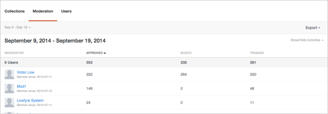

# Analytics{#analytics}

Analysieren Sie Benutzer, Inhalte und Moderatoraktivitäten für Ihre Site.

## Analytics {#topic_22D8FAE581CD440EA02B1595520F60C2}

Analysieren Sie Benutzer, Inhalte und Moderatoraktivitäten für Ihre Site.

Livefyre Analytics bietet Zugriff auf Ihre Netzwerkdaten in leicht lesbaren Dashboards für Unterhaltungen, Moderation und Benutzerdaten. Verwenden Sie diese Dashboards, um Aktivitäten zu überwachen und schnelle Analysen auf Ihren Site (n) auszuführen.

Dashboards können nach Site, Datum und Aktivität gefiltert werden. Verwenden Sie das Netzwerkpulldown oben links im Fenster, um eine Site anzuzeigen. Klicken Sie nach dem Generieren auf eine Spaltenüberschrift, um sie zu sortieren, oder bewegen Sie den Mauszeiger über das Diagramm, um speziellere Informationen zu einem beliebigen Datenpunkt zu erhalten.

Diese Seite beschreibt:

* Auswahl eines [Datumsbereichs](https://answers.livefyre.com/livefyre-studio-version-1/studio/analytics/#DateRange) für Ihr Dashboard
* [Anzeigen/Ausblenden verfügbarer Aktivitäten](https://answers.livefyre.com/livefyre-studio-version-1/studio/analytics/#ShowHideActivities)
* [Exportieren von Dashboard-Daten](https://answers.livefyre.com/livefyre-studio-version-1/studio/analytics/#ExportDashboardData)
* [Das Sammlungendashboard](https://answers.livefyre.com/livefyre-studio-version-1/studio/analytics/#CollectionsDashboard)
* [Das Moderations-Dashboard](https://answers.livefyre.com/livefyre-studio-version-1/studio/analytics/#ModerationDashboard)
* [Das Benutzer-Dashboard](https://answers.livefyre.com/livefyre-studio-version-1/studio/analytics/#UsersDashboard)

>[!NOTE]
>
>Derzeit werden Aktivitäten unterstützt, die von Livefyre Core-Apps und -moderationen stammen. Die meisten Aktivitäten, die in diesen Dashboards enthalten sind, stehen auch über [Livefyre-javascript-Ereignisse zur Verfügung](https://answers.livefyre.com/developers/reference/app-customizations/javascript-events/), die genutzt werden können, um Ihr eigenes Tool für benutzerdefinierte oder Drittanbieteranalysen zu nutzen.

## Datumsbereich {#concept_798C438120E643B6BE262C9997DC87C4}

Klicken Sie auf den Datumspulldown, um einen Bereich auszuwählen, der angezeigt werden soll. Verwenden Sie die kurzen Datumsangaben oder wählen Sie ein Start- und Enddatum aus den Kalendern aus.

Kurzdaten:

* **Heute:** Zeigt Daten von Mitternacht am Morgen des aktuellen Tages an, bis zur letzten vollen Stunde vor diesem Moment.
* **Gestern:** Zeigt die Daten der letzten 24 Stunden an.
* **7 Tage:** Zeigt die Daten der vorherigen 7 Tage an, die heute nicht eingeschlossen werden.
* **30 Tage:** Zeigt die Daten der letzten 30 Tage an, die heute nicht eingeschlossen werden.
* **Diese Woche:** Zeigt Daten von Mitternacht am Morgen des letzten Sonntag an, bis zur letzten vollen Stunde vor diesem Moment.
* **Diesen Monat:** Zeigt Daten von Mitternacht am Morgen des ersten Tages des aktuellen Monats an, bis zur letzten vollen Stunde vor diesem Moment.
* **Letzte Woche:** Zeigt die Daten der letzten Woche an.
* **Letzter Monat:** Zeigt die Daten des letzten Monats an.

## Anzeigen/Ausblenden von Aktivitäten {#concept_022D9851CBCE4A2FB80D0AE52A23744D}

Aktivitäten sind Aktionen, die Benutzer auf Ihrer Site ausführen, einschließlich Kommentierung, Kennzeichnung, Freigabe und Moderation. Verwenden Sie das **Pulldown Aktivitäten** anzeigen/ausblenden, um Aktivitäten auszuwählen, die in Ihr Dashboard aufgenommen werden sollen.

>[!NOTE]
>
>Durch Auswahl neuer Ereignisse für den Filter wird die Seite erneut wiedergegeben, ohne dass die URL geändert wird.

Verfügbare Aktivitäten variieren je nach Dashboard-Typ und Export und können Folgendes umfassen:

* **Beiträge:** Zeigt Daten von Mitternacht am Morgen des aktuellen Tages an, bis zur letzten vollen Stunde vor diesem Moment.
* **Antworten:** Zeigt die Daten der letzten 24 Stunden an.
* **" Gefällt mir" -Klicks:** Zeigt die Daten der vorherigen 7 Tage an, die heute nicht eingeschlossen werden.
* **" Gefällt mir nicht" -Klicks:** Zeigt die Daten der letzten 30 Tage an, die heute nicht eingeschlossen werden.
* **Enthält Medien:** Zeigt Daten von Mitternacht am Morgen des letzten Sonntag an, bis zur letzten vollen Stunde vor diesem Moment.
* **Beitrag hat Foto-Upload:** Zeigt Daten von Mitternacht am Morgen des ersten Tages des aktuellen Monats an, bis zur letzten vollen Stunde vor diesem Moment.
* **Beitrag hat einen Link:** Zeigt die Daten der letzten Woche an.
* **Beitrag hat @ Erwähnungen:** Zeigt die Daten des letzten Monats an.
* **Genehmigt:** Zeigt die Daten des letzten Monats an.
* **Bozo'd:** Zeigt die Daten des letzten Monats an.
* **Umbruch:** Zeigt die Daten des letzten Monats an.
* **Moderation insgesamt:** Zeigt die Daten des letzten Monats an.

## Exportieren von Dashboard-Daten {#concept_730DB61A9F894BE6BFB34E0E2A421ED3}

Verwenden Sie das **Pulldown** -Menü, um Ihre Dashboard-Daten als CSV-Datei zu exportieren.

* Digest täglich (nur Sammlungen): exportiert die tägliche Talente der letzten vervollständigen Woche für jede Sammlung.
* Tabellendaten: exportiert alle aggregierten Sammlungsdaten (alle Spalten und alle Zeilen im aktuellen Bericht).
* Rohdaten: exportiert alle einzelnen Ereignisse, die zum Erstellen des aktuellen aggregierten Berichts verwendet wurden.

>[!NOTE]
>
>Diese Berichte können einige Minuten in Anspruch nehmen. Alle Zeitstempel sind Unix-Zeit.

## Sammlungen {#concept_228D8E5553784DB8BABF3819A5FF0345}

Das Dashboard Sammlungen listet die Benutzeraktivität nach Kollektion auf, wodurch Sie Ihren bevorzugten (oder am wenigsten geeigneten) Inhalt bestimmen können. Jede aufgeführte Sammlung enthält einen Link zu der Seite, auf der sie gefunden werden kann.

## Moderation {#concept_98689B1E804B43CEA21E3F456107CCD9}

Im Dashboard Moderation werden Ereignisse nach Moderatoren aufgelistet, sodass sie ihre Aktivität bewerten können. Verwenden Sie diesen Bericht, um Ihre aktivsten Moderatoren und ihre häufigsten Moderationsaktionen zu finden.

>[!NOTE]
>
>Automatisierte Livefyre-Moderationsaktivitäten werden für den Moderatornamen Livefyre-System aufgeführt.

## Benutzer {#concept_D1A83E31C7B5467F9C844CBF9A740E12}

Das Dashboard "Benutzer" zeigt die Site-Aktivität nach Benutzer an, sodass Sie analysieren können, wie einzelne Benutzer mit Ihrer Site interagieren. Verwenden Sie dieses Dashboard, um Ihre aktivsten Benutzer auf Ihrer gesamten Site zu finden und die beliebtesten Site-Aktivitäten zu bewerten.

