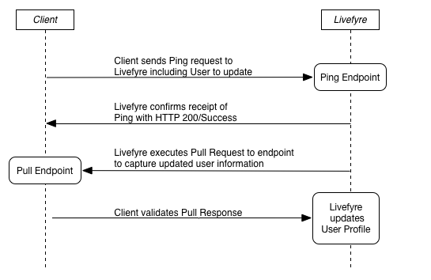

# Mit Livefyre mit Ping für Pull synchronisieren{#sync-with-livefyre-using-ping-for-pull}

Verwenden Sie Ping für Pull, um Livefyre mit Ihrem Benutzerverwaltungssystem synchron zu halten.

Im Allgemeinen ***wird durch Ping*** von Ping Livefyre ein Benutzer Ihrer Website/App aktualisiert (Anzeigename, Avatar usw.) und Livefyre ***ruft*** das aktualisierte Profil des Benutzers ab.

Ping für Pull-Sequenz:

1. Der Kunde sendet Ping-Anfrage an Livefyre (einschließlich des zu aktualisierenden Benutzers).
1. Livefyre bestätigt den Ping von Ping mit HTTP 200/Success.
1. Livefyre verarbeitet Anforderungen.
1. Livefyre-Warteschlangenanforderung.
1. Livefyre führt die Pull-Anforderung an den Endpunkt aus, um aktualisierte Benutzerinformationen zu erfassen.
1. Der Kunde erhält die Pull-Antwort und überprüft.
1. Livefyre aktualisiert Remote Profile mit den externen Profilinformationen, die im Pull-Endpunkt enthalten sind.

Ping von Livefyre, wenn ein Benutzer seine Profilinformationen aktualisiert. Während Ping für Pull-Abschlusszeiten je nach Netzwerklast variieren kann, werden die Benutzerinformationen zwischen 1 und 10 Minuten aktualisiert. Aktualisierte Profiländerungen werden zuerst in Livefyre Studio > Benutzer angezeigt.

Aktualisierte Profilinformationen werden in Ihren Livefyre-Apps nach zwei Ereignissen angezeigt:

* Ein Benutzer meldet sich ab und meldet sich dann wieder an der App an. Werte für Anzeigenamen im userauthtoken haben Vorrang vor Ping für Pull-Aktualisierungen. Ein Benutzer-Abonnement/-Anmeldung aktualisiert das Token, um die Sitzung zu aktualisieren.

   Um neue userauthtokens beim Aktualisieren von Profilinformationen zu generieren, verwenden Sie SSO authdelegate, um Ihren Benutzer wieder im Hintergrund anzumelden.

* Ein Bootstrap-Update zur Sammlung führt zu aktualisierten Informationen (höchstens 5 bis 10 Minuten).

So implementieren Sie Ping für das Abrufen für Ihr Benutzerprofilsystem:

1. [Erstellen Sie den Pull-Endpunkt](#t_build_the_pull_endpoint).

   >[!NOTE]
   >
   >Die Livefyre-Bibliothek enthält eine syncuser-Methode, um Ihre Benutzerprofile auf dem aktuellen Stand zu halten. Überspringen Sie die nächsten beiden Schritte, wenn Sie die Livefyre-Bibliothek verwenden.

1. [Registrieren Sie den Pull-Endpunkt in Studio](#register_the_endpoint_with_studio).
1. [Erstellen Sie das Ping](#t_build_the_ping).
1. [Erstellen Sie das Ping für Pull Response].(# reference_ n 3 x_ pite_ mz)
