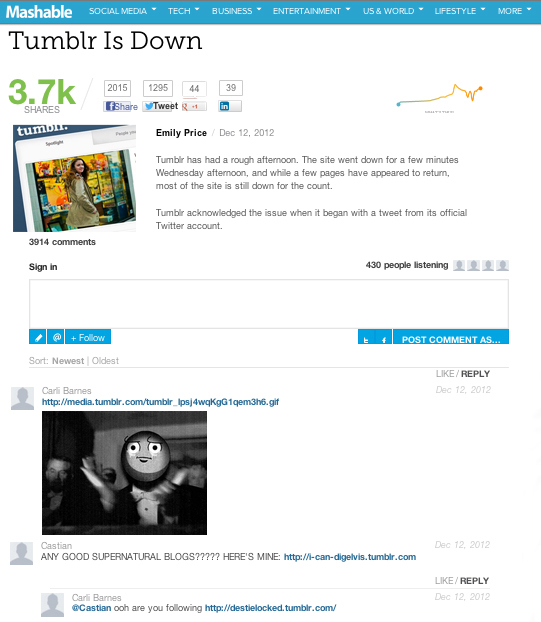

# Kommentare{#comments}

Betten Sie Kommentare in Echtzeit in Ihre App ein.

Kommentare ersetzen Ihre Standardkommentare durch Echtzeitunterhaltungen. Mit unseren Social-Integrationsfunktionen können Sie alle Unterhaltungen über Ihre Beiträge über Twitter und Facebook hinweg erfassen und die Freunde des Benutzers in die Unterhaltungen ziehen.

Mashable verwendet Kommentare, um die Benutzerbeteiligung in ihren Diskussionen zu steigern. Funktionen wie Hochladen von Rich Media, Social Sharing, Anzahl der Listener und Single Sign-On helfen Ihnen, einen Beitrag zur Konversation und zum Vergnügen zu machen.

<!-- 

c_comments_app.dita

 -->

