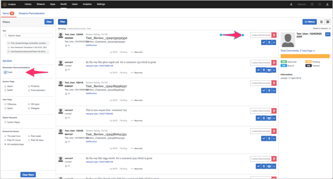

# SAFE RULES{#safe-rules}

Die Livefyre Spam- und die Missbrauchsfilterengine (SAFE) sind ein Hintergrundprozess, der alle eingehenden Inhalte analysiert und für alle Livefyre-Kunden aktiviert ist.

SAFE verwendet Musterregeln sowie statistische Modelle, um Spam, Missbrauch, Gewinn- und Massen-Beiträge (wiederholte) Beiträge zu erkennen. Es wird von Zeit zu Zeit in anderen Livefyre-Produkten referenziert, insbesondere in den Inhaltsmoderationstools und in modq.

>[!NOTE]
>
>SAFE ist nur für Englisch vorgesehen, außer für die Massen-Maililing-Klassifizierung. Wenn Sie Unterstützung für andere Sprachen benötigen, wenden Sie sich bitte an Ihren strategischen Kundenbetreuer.

## Studio-Komponenten mit SAFE {#section_k34_4tx_vy}

Durch SAFE angewendete Flags können mit den folgenden Studio-Komponenten verwendet werden:

* Regeln

   Sie können SAFE-Regeln definieren, um Inhalte automatisch zu kennzeichnen und zu definieren, wie gekennzeichnete Inhalte im Abschnitt verarbeitet **[!UICONTROL Network Settings]**werden sollen.

   Beispiel: Eine Site kann eine sehr niedrige Toleranz für Gewinn festlegen und SAFE Rules definieren, die den gesamten Inhalt als "Profit" auf" Bozo" setzen. Andere Sites können Regeln definieren, die festlegen, dass Ppane-Inhalte vor der Eingabe des Streams bereits moderiert werden.

* Modq

   Sie können durch SAFE-Regeln gekennzeichnete Inhalte und andere Prämoderationsregeln (z. B. SPAM, Gewinn usw.) im modq moderieren.

* App-Inhalte in der Bibliothek

   Der von SECURE markierte Inhalt wird im App-Inhalt auf der **[!UICONTROL Library]** Registerkarte aufgeführt. Sie können Inhalte nach Flags filtern, um Inhalte zu moderieren.

## Optionen für SAFE Filter {#section_pg5_ttx_vy}

SAFE wendet die folgenden Flags auf gefilterte Inhalte an und kann verwendet werden, um Regeln zu erstellen und Inhalte aus Livefyre Studio zu moderieren.

* **[!UICONTROL Profanity List]**: von einer Liste mit englischsprachigen Suchbegriffen, wie in einer Liste der englischen Suchbegriffe definiert.

   Der Gewinn-Filter sucht anhand einer getesteten Wortliste nach Profit-Sprache. Wenn der Inhalt erkannt wird, wird er als Gewinn gekennzeichnet.

   >[!NOTE]
   >
   >Livefyre bietet außerdem einen zweiten Gewinnspiellistenfilter, der sowohl auf der Site- als auch auf der Netzwerkebene angepasst werden kann. Mit der Gewinn-Liste erstellte Regeln haben Vorrang vor automatisierten Regeln, die aus dem Filter SICHERER GEWINN stammen. Weitere Informationen finden Sie im Abschnitt "Gewinnspiel-Liste" in der Einstellungsdokumentation.

* **[!UICONTROL Mild Profanity]**: Wörter und Ausdrücke sind in polieren Unterhaltungen im Allgemeinen nicht akzeptabel, sind aber in sporadischen Unterhaltungen normalerweise akzeptabel. Im Allgemeinen sind diese Wörter und Ausdrücke im Netzwerkfernseher zulässig.
* **[!UICONTROL Strong Profanity]**: Eine sehr starke Sprache, z. B. Expletive und Ausdrücke, die im Netzwerkfernseher nicht zulässig sind und sparsam in R-bewertet-Filmen und ausgefüllten Kabelfernsehgeräten verwendet werden. Im Allgemeinen werden diese Wörter nicht in polieren oder sporadischen Unterhaltungen verwendet und in einer impolierten Unterhaltung mit Absicht gesagt, den Listener zu beschädigen.
* **[!UICONTROL SPAM]**: Unleserlich, normalerweise kommerzieller Inhalt. Es verwendet ein statistisches Modell, das auf einer Vielzahl von Funktionen basiert (einschließlich Kommentarinhalt und urls), um einen Inhalt als SPAM zu kennzeichnen. Sie können Spam-Schwellenwerte anpassen, um SPAM-Tagging-Raten für Ihr Netzwerk oder Ihre Site auf Anforderung anzupassen.
* **[!UICONTROL Mild Insult]**: Isolieren von Inhalten, wie in einer Liste mit Suchbegriffen und Wortmustern definiert.
* **[!UICONTROL Strong Insult]**: Isolieren von Inhalten, wie in einer Liste mit Suchbegriffen und Wortmustern definiert.
* **[!UICONTROL Hate Speech]**: Eine auf der ethnischen Zugehörigkeit oder Religion basierende Beleidigung, insbesondere wenn sich die Zielgruppenzugehörigkeit in einer Minderheit oder in einer geschützten Gruppe befindet.
* **[!UICONTROL ALL CAPS]**: Text, der in allen Großbuchstaben angezeigt wird (als Yelling gelesen).
* **[!UICONTROL Mild Threat]**: Eine Bedrohung oder Beleidigung, die normalerweise eine Art Mild-Profit enthält, die an eine andere Person gerichtet ist. Diese Option kennzeichnet mögliche Bedrohungen häufiger, hat aber auch eine höhere Falsch-Positiv-Rate als **[!UICONTROL Strong Threat]**.

* **[!UICONTROL Strong Threat]**: Eine ernsthafte Bedrohung oder Beleidigung, die einem oder mehreren Menschen nachvollziehbaren Schaden schadet, häufig mit starker Gewinnbereitschaft. Diese Option kennzeichnet mögliche Bedrohungen weniger häufig, hat aber auch eine niedrigere Falsch-Positiv-Rate als **[!UICONTROL Mild Threat]**.

* **[!UICONTROL Probable Nudity]**: Ein Bild, das ggf. etwas Nusity enthält. Diese Option kennzeichnet die Nuance seltener, hat aber auch eine niedrigere Falsch-Positiv-Rate als **[!UICONTROL Possible Nudity]**.

* **[!UICONTROL Possible Nudity]**: Ein Bild, das ggf. etwas Nusity enthält. Diese Option markiert die Nuance häufiger, hat aber auch eine höhere Falsch-Positiv-Rate als **[!UICONTROL Probable Nudity]**.

* **[!UICONTROL PII]** (Personenbezogene Informationen): Informationen, die den Benutzer identifizieren können. Dies kann eine E-Email-Adresse, physische Adresse, Sozialversicherungsnummer (für US-Kunden), Kreditkartennummer, ein Kennwort oder alles, was zum Betrug verwendet werden kann, oder zum Erlangen der Identität eines Benutzers beinhalten.
* **[!UICONTROL Livefyre Recommends Trash]**. Legen Sie die Aktion fest, die das System durchführt, wenn die automatisierte Moderationsempfehlung Inhalte zur Ablehnung identifiziert. 

   >[!NOTE]
   >
   >Wenden Sie sich an Ihren Adobe Livefyre-Support-Mitarbeiter, um die Moderationsempfehlungen zu aktivieren.

## Verarbeiten von Inhalt, der nicht durch SAFE erfasst wird {#section_pjy_5tx_vy}

Es gibt mehrere Möglichkeiten zur effektiven Handhabung von Inhalten, die nicht von diesem Filter erfasst werden. Die unten aufgeführten Optionen werden in der empfohlenen Reihenfolge des Prozesses aufgeführt.

1. Entfernen Sie als Moderator den Inhalt aus dem Stream.
1. Erstellen Sie eine Flag-Regel, die besagt, dass ein Inhaltselement von fünf Benutzern als Spam oder Offensive gekennzeichnet ist, indem Sie es auf "Bozo" setzen.
1. Sperren Sie den Benutzer, der unerwünschte Inhalte veröffentlicht, sodass alle Inhalte direkt in den Bozo-Zustand gelangen.
1. Fügen Sie spezifische Wörter hinzu, die immer in Ihrer Gewinn-Liste gefiltert werden sollten.

>[!NOTE]
>
>Wenn ein Moderator Inhalt von unserem Spam-Filter erfasst, wird er dennoch als Spam gekennzeichnet, wird jedoch automatisch genehmigt und wird nicht auf "Bozo" eingestellt.

Wenn Sie Trends oder Muster von nicht von SAFE abgedeckten Inhalten bemerken, senden Sie Ihre csms mit den Kommentar-IDs und Text per E-Email.

Apps, die diese Funktion verwenden:

* [Karussell](/help/using/c-about-apps/c-carousel-app/c-carousel-app.md#c_carousel_app)
* [Chat](/help/using/c-about-apps/c-chat-app/c-chat-app.md#c_chat_app)
* [Kommentare](/help/using/c-about-apps/c-comments/c-comments.md)
* [Feature Card](/help/using/c-about-apps/c-feature-card-app/c-feature-card-app.md#c_feature_card_app)
* [Map](/help/using/c-about-apps/c-map-app/c-map-app.md#c_map_app)
* [Medienpinnwand](/help/using/c-about-apps/c-media-wall-app/c-media-wall-app.md#c_media_wall_app)
* [Mosaik](/help/using/c-about-apps/c-mosaic-app/c-mosaic-app.md#c_mosaic_app)
* [Reviews](/help/using/c-about-apps/c-reviews-app/c-reviews-app.md#c_reviews_app)
* [Zielgruppen](/help/using/c-about-apps/c-sidenotes-app/c-sidenotes-app.md#c_sidenotes_app)
* [Storify 2](/help/using/c-about-apps/c-storify2/c-storify2.md#c_storify2)
* [Hochladen-Schaltfläche](/help/using/c-about-apps/c-upload-button-app/c-upload-button-app.md#c_upload_button_app)

