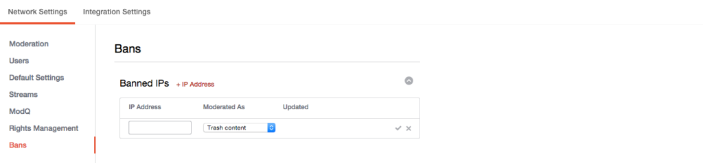

# IP-Adressen verbieten{#ban-ip-addresses}

Sie können IP-Adressen sperren, wenn ein böswilliger Benutzer mehrere Konten aus derselben IP-Adresse erstellt.

Wenn ein verbotener Benutzer erkennt, dass niemand seine Kommentare sieht, können sie ein neues Benutzerkonto mit einem anderen Benutzernamen und einem anderen Benutzernamen erstellen und mit dem Posten unangemessener oder Spam-Kommentare aus diesem neuen, nicht verbotenen Konto beginnen. Ihre Moderatoren erkennen den Inhalt möglicherweise als derselbe Benutzer und bestätigen diese Annahme, indem sie die IP-Adresse des Benutzers überprüfen, der die Kommentare sendet (auf der Seite Kontodetails).

1. Klicken **[!UICONTROL + IP Address]** Sie in das Bedienfeld "Eingeschränkte ips" .
1. Geben Sie die IP-Adresse in das Feld ein. Um einen Bereich von IP-Adressen zu unterteilen, geben Sie den Bereich im Format "192.168.0.1 - 192.168.0.10" ein (trennen Sie die IP-Adressen durch Leerzeichen und einen Bindestrich in Anführungszeichen) und klicken **[!UICONTROL Save]**Sie auf.
1. Wählen Sie eine Aktion aus dem Pulldown-Menü (Papierkorb, Prämoderation oder Bozo-Inhalt).
1. Klicken Sie auf das zu speichernde Häkchen.
