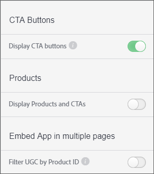

# Benutzerdefinierte Aktionsaufruf-Schaltfläche{#custom-call-to-action-button}

## Benutzerdefinierte Aktionsaufruf-Schaltfläche {#topic_EBE23A0F827645E0A0C619DCF3872EE5}

Benutzerdefinierte Aktionsaufruf-Schaltflächen (CTA) sind Schaltflächen, die zu jedem Asset in Livefyre Studio hinzugefügt werden können, um den Inhalt zu verarbeiten. Sie können Endbenutzer auf eine beliebige benutzerdefinierte URL verweisen, z. B. eine Social Media-Seite oder einen Warenkorb. CTA-Schaltflächen können an mehreren Stellen in Livefyre erstellt werden, sie werden jedoch im Abschnitt **[!UICONTROL Settings]** von Livefyre Studio verwaltet.

Mit benutzerspezifischen CTAs können Sie:

* hinzufügen Sie benutzerdefinierte CTA-Schaltflächen für beliebige UGC-Elemente in Ihren Livefyre-Medienwänden, Mosaiken, Karussells, Filmstreifen und auf einzelnen Funktionskarten.
* Kontrollieren Sie die Meldung, Symbole, Farben, Links und die Anzahl der Schaltflächen auf jedem Teil des benutzerspezifischen Informationsspeichers.
* Erstellen, verwalten und verwenden Sie benutzerdefinierte CTA-Schaltflächen aus den Einstellungen und der Bibliothek.
* Verwenden Sie Adobe Analytics zur Messung der Durchklickraten.

## Erstellen einer benutzerdefinierten Aktionsaufruf-Schaltfläche {#task_C61B4A8E66F24AC19C833612E596B736}

Kontext der Aufgabe

1. Klicken Sie in Livefyre Studio auf **[!UICONTROL Settings]**.
1. Klicken Sie in der linken Leiste auf **[!UICONTROL CTAs]**.

   Die CTA-Bibliothek wird angezeigt, in der CTAs erstellt und in Ordnern organisiert werden können. 1. Klicken Sie auf **[!UICONTROL Create CTA]**.
1. Füllen Sie die Felder mit den gewünschten Anpassungen aus, und eine Schaltflächen-Vorschau wird am unteren Rand des Bildschirms &quot;CTA erstellen&quot;gerendert.

   

1. Klicken **[!UICONTROL Create]**.

   Die Schaltfläche &quot;CTA&quot;steht jetzt zur Verfügung, um einem beliebigen Asset hinzugefügt zu werden.

## hinzufügen einer benutzerdefinierten Aktionsaufruf-Schaltfläche zu einem Asset {#task_36190DD1C8204C7793CB7EEA379C2155}

hinzufügen Sie eine CTA-Schaltfläche zu einem beliebigen Inhalt in Livefyre Studio.

1. Navigieren Sie im Livefyre-Studio zu **[!UICONTROL Library]** > **[!UICONTROL All Assets]**.
1. Wählen Sie eines oder mehrere Assets aus, denen Sie eine CTA-Schaltfläche hinzufügen möchten.
1. Klicken **[!UICONTROL CTAs]**.

   

1. Wählen Sie die gewünschte CTA-Schaltfläche aus der Liste und klicken Sie dann auf **[!UICONTROL Add]**.

   Die Schaltfläche &quot;CTA&quot;wird jetzt für das ausgewählte Asset angezeigt.

   >[!NOTE]
   >
   >Damit die benutzerspezifischen CTAs, die Sie mit jedem Asset verknüpfen, in einer App angezeigt werden, müssen Sie die CTA-Schaltflächen in den App-Einstellungen aktivieren:
   >
   >
