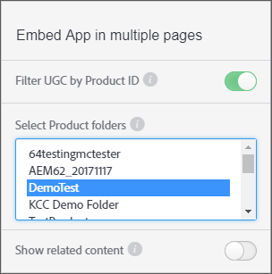

# UGC nach Produkt-ID {#filter-ugc-product-id} filtern

Wenn Sie UGC nach Produkt-ID filtern, können Sie die gleiche App auf mehreren Seiten einbetten und dabei für jede Seite eine andere produktspezifische UGC anzeigen.

Gehen Sie wie folgt vor, um UGC nach Produkt-ID zu filtern:

1. Navigieren Sie in Livefyre Studio zur Registerkarte **[!UICONTROL Apps]**.

1. Wählen Sie die App aus, die Sie ändern möchten.

1. Wählen Sie in der linken Leiste die Registerkarte &quot;Designer&quot;.

1. Aktivieren **[!UICONTROL Filter UGC by Product ID]**.



1. Wählen Sie die Produktordner auf der obersten Ebene aus, die das Produkt oder die Produkte enthalten, nach denen Sie UGC filtern möchten.
Verwenden Sie STRG/Befehl + Klicken, um mehrere Ordner auszuwählen.

1. Deaktivieren Sie **[!UICONTROL Show related content]**.
Wenn diese Option aktiviert ist, werden zuerst Inhalte angezeigt, die mit dem `data-lf-attr-product`-Attribut gefiltert werden, gefolgt von allen anderen Inhalten in der App.

1. Klicken **[!UICONTROL Publish]**.

1. Fügen Sie die Produkt-IDs, nach denen Sie filtern möchten, in den resultierenden Code ein.

>[!NOTE]
>
>Um Produkt-IDs zu suchen, navigieren Sie zu **[!UICONTROL Settings > Products]**. Suchen Sie das gewünschte Produkt und wählen Sie es aus, und die ID wird angezeigt.

Beispielsweise wird der folgende Code für eine Media Wall App generiert:

```
<script type="text/javascript" src="https://cdn.livefyre.com/
Livefyre.js"></script><div class="lf-app-embed" data-lfapp="
59dc41fa-85a5-49ed-8d60-d74616b3ccd1/tagged/published" datalf-
env="prod" data-lf-read-only="" data-lf-attr-product="<product
 1>,<product 2>"></div><script>Livefyre.require(["app-embed#1.0.11"],
 function (appEmbed) {appEmbed.loadAll().done(function(embed)
 {embed = embed[0];if (embed.el.onload && embed.getConfig)
 {embed.el.onload(embed.getConfig());}});});</script>
```

Um ein Produkt zu taggen, ersetzen Sie `<product 1>` im `data-lf-attr-product`-Attribut durch die gewünschte Produkt-ID. Sie können ein Produkt oder mehrere Produkte mit Tags versehen, indem Sie zusätzliche durch Kommas getrennte Produkt-IDs hinzufügen. Produkte müssen im Produktordner oder in den Ordnern der obersten Ebene enthalten sein, die in Schritt 5 ausgewählt wurden.

Das geänderte Codesegment würde wie folgt aussehen:

```
<script type="text/javascript" src="https://cdn.livefyre.com/
Livefyre.js"></script><div class="lf-app-embed" data-lfapp="
59dc41fa-85a5-49ed-8d60-d74616b3ccd1/tagged/published"
 data-lf-env="prod" data-lf-read-only="" data-lf-attrproduct="
109,47"></div><script>Livefyre.require(["app-embed#1.0.11"],
 function (appEmbed) {appEmbed.loadAll().done(function(embed)
 {embed = embed[0];if (embed.el.onload && embed.getConfig)
 {embed.el.onload(embed.getConfig());}});});</script>
```

Die App zeigt jetzt nur die getaggten Produkt-IDs an.