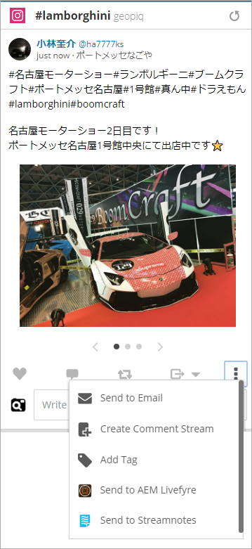

# Verwenden von Adobe Experience Manager Livefyre mit Hootsuite{#use-adobe-experience-manager-livefyre-with-hootsuite}

Erfahren Sie, wie Sie Experience Manager Livefyre mit Hootsuite verwenden können, um benutzergenerierte Inhalte direkt über das Hootsuite-Dashboard zu kuratieren, zu verwalten und freizugeben.

## Verwenden von Adobe Experience Manager Livefyre mit Hootsuite {#topic_FB6E613DBCF74F39ABD5045C501EA326}

Erfahren Sie, wie Sie Experience Manager Livefyre mit Hootsuite verwenden können, um benutzergenerierte Inhalte direkt über das Hootsuite-Dashboard zu kuratieren, zu verwalten und freizugeben.

## Erste Schritte {#task_22699BD901C24384AB2DC02D926D8F4A}

Aufgabenkontext

1. Installieren Sie Adobe Experience Manager Livefyre für Hootsuite aus dem Verzeichnis &quot;Hootsuite App&quot;.

1. Klicken Sie im Hootsuite-Dashboard auf **Mit Adobe anmelden**.

   

1. Melden Sie sich mit Ihren Livefyre-Anmeldedaten bei Experience Manager Livefyre an.
1. Klicken **Autorisieren** , um Hootsuite-Berechtigungen für den Zugriff auf Ihre Bibliotheken zu erteilen.

   

   Nachdem Sie die Berechtigung erteilt haben, gelangen Sie zum Hootsuite-Dashboard, über das Sie in Ihren Experience Manager-Livefyre-Bibliotheken nach Assets suchen können.

## Suche nach Assets {#task_0B011B0C539E400BB72A6DF69FBF66C0}

Aufgabenkontext

1. Klicken Sie in der Menüleiste auf das Suchsymbol, um in Ihren Experience Manager Livefyre-Bibliotheken nach Assets zu suchen.

   

1. Klicken **Auswählen** und ein Popup mit all Ihren Bibliotheken angezeigt.
1. Klicken Sie auf den Ordner einer Bibliothek und dann auf **Ordner auswählen** , um die Bibliothek auszuwählen, die in Ihrem Hootsuite-Stream angezeigt wird.

   

## Filteroptionen {#concept_5D062A9CD61A4B2E90784E5AA31CB16D}

Sie können Ihre Suchergebnisse mithilfe der Abschnitte &quot;Assets anzeigen von&quot;, &quot;Rechte&quot;, &quot;Keywords&quot;und &quot;Tags&quot;filtern.

Zu den Filteroptionen gehören:

| Abschnitt | Beschreibung |
|--- |--- |
| Anzeigen von Assets aus | Wählen Sie diese Option, um Assets aus allen Quellen oder aus einer einzelnen Quelle anzuzeigen. Beispiel: Instagram, Twitter, Facebook usw. |
| Rechte | Wählen Sie diese Option, um nur Assets mit einer bestimmten Berechtigungseinstellung anzuzeigen. |
| Keywords | Wählen Sie diese Option aus, um die Ergebnisse nach Keywords oder Tags zu filtern. Beim Filtern nach Keywords werden der Textinhalt eines Beitrags sowie der Anzeigename des Autors und der Benutzername des Autors durchsucht. |
| Tags | Wählen Sie diese Option aus, um die Ergebnisse nach Keywords oder Tags zu filtern. Beim Filtern nach Keywords werden der Textinhalt eines Beitrags sowie der Anzeigename des Autors und der Benutzername des Autors durchsucht. |

Nachdem Sie Ihre Suchparameter ausgewählt haben, werden Ihre Assets bei der Suche in Stream angezeigt:

### Optionen für Stream-Menü

Durch Klicken auf den Namen oder das Symbol des Benutzers wird der Benutzer im entsprechenden Netzwerk angezeigt. Wenn Sie auf die Zeit klicken, wird der ursprüngliche Artikel angezeigt. Wenn Sie mit der Maus über das Element fahren, werden weitere Optionen angezeigt. Klicken auf Freigeben 

-Symbol fügt das aktuelle Asset zum Feld &quot;Netzwerkkomposition&quot;hinzu, sodass Sie es über die Hootsuite für Ihre Netzwerke freigeben können.

>[!NOTE]
>
>Die Schaltfläche &quot;Freigeben&quot;wird nur angezeigt, wenn Sie nach Assets mit zugewiesenen Berechtigungen filtern.

Klicken Sie auf Zuweisen   -Symbol, um das aktuelle Element einem Mitglied Ihres Hootsuite-Teams zuzuweisen. Wenn ein Element bereits zugewiesen wurde, wird die  wird angezeigt. Klicken Sie darauf, um die aktuelle Zuweisung aufzulösen.

### Andere App-Menüs

Klicken auf Einstellungen   über das Symbol können Sie die Verbindung zum aktuellen Experience Manager-Livefyre-Konto trennen und eine Verbindung zu einem anderen Konto herstellen.

Klicken auf das Menü   zeigt Links zu diesem Dokument, Support und der Synaptive-Website an.

## Experience Manager Livefyre-App-Plugin {#task_33C8CEF4F5E44830B970BB3A7AAA2AA6}

Sie können Ihre Asset-Bibliotheken nicht nur in einem Hootsuite-Stream anzeigen, sondern auch Elemente aus Instagram, Twitter, Facebook und YouTube-Streams in Ihren Experience Manager Livefyre-Bibliotheken speichern.

1. Klicken Sie auf das Menüsymbol, das sich unten in jedem Element befindet.

   

1. Auswählen **Senden an AEM Livefyre**.
1. Wählen Sie eine oder mehrere Bibliotheken aus, in denen das Asset gespeichert werden soll.

   

1. Klicken **In Bibliothek speichern** und das Element in den ausgewählten Bibliotheken gespeichert wird.

## Experience Manager Livefyre Media Library-Komponente {#task_9CA2D5D49F8E463F9EF475BC09C8ACC9}

Sie können über die Medienkomponenten von Hootsuite Composer auf Ihre Assets zugreifen.

1. Klicken Sie im Composer auf die **Media Library öffnen** im **Medien** Abschnitt.

   

1. Wählen Sie Adobe Experience Manager Livefyre aus dem Dropdown-Menü aus, und Ihre Dateien werden angezeigt.

   

1. Um dem aktuellen Beitrag, den Sie schreiben, ein Asset hinzuzufügen, klicken Sie darauf. Um nach einem bestimmten Asset zu suchen, geben Sie die Suchbegriffe in die **Suchmedien** und die Ergebnisse werden angezeigt.
