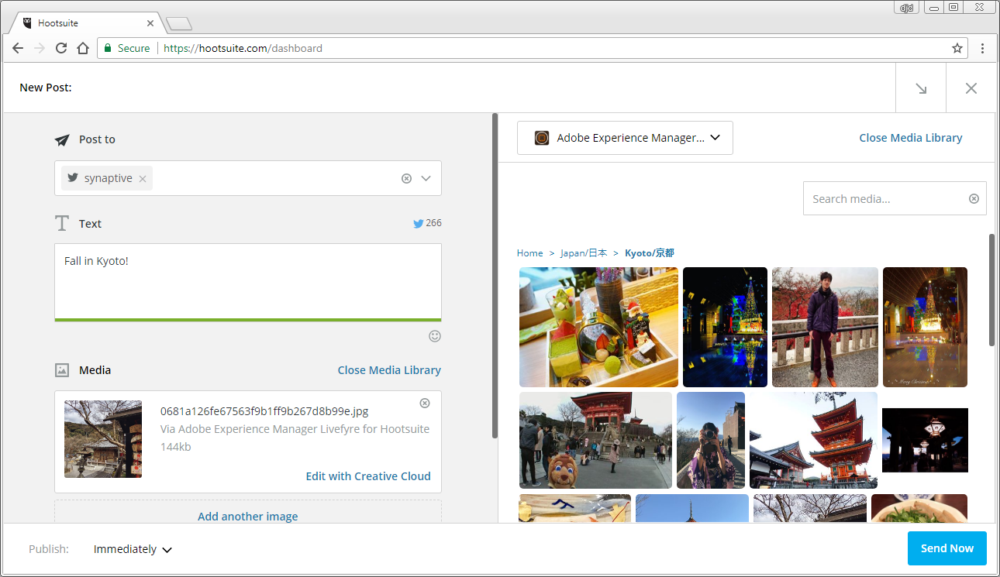

# Verwenden von Adobe Experience Manager Livefyre mit Hootsuite{#use-adobe-experience-manager-livefyre-with-hootsuite}

Erfahren Sie, wie Sie Experience Manager Livefyre mit Hootsuite verwenden, um benutzergenerierte Inhalte direkt über das Hootsuite-Dashboard kuratieren, verwalten und freigeben zu können.

## Verwenden von Adobe Experience Manager Livefyre mit Hootsuite {#topic_FB6E613DBCF74F39ABD5045C501EA326}

Erfahren Sie, wie Sie Experience Manager Livefyre mit Hootsuite verwenden, um benutzergenerierte Inhalte direkt über das Hootsuite-Dashboard kuratieren, verwalten und freigeben zu können.

## Erste Schritte {#task_22699BD901C24384AB2DC02D926D8F4A}

Aufgabenkontext

1. Installieren Sie Adobe Experience Manager Livefyre für eine Suite aus dem Verzeichnis der Hootsuite-App.

1. Klicken Sie in Ihrem Hootsuite-Dashboard auf **Anmelden bei Adobe**.

   

1. Melden Sie sich mit Ihren Livefyre-Anmeldeinformationen bei Experience Manager Livefyre an.
1. Klicken Sie auf **Autorisieren** , um Hootsuite Zugriff auf Ihre Bibliotheken zu gewähren.

   

   Nachdem Sie die Berechtigung erteilt haben, werden Sie zum Hootsuite-Dashboard zurückgeleitet, wo Sie in Ihren Experience Manager Livefyre-Bibliotheken nach Assets suchen können.

## Suche nach Assets {#task_0B011B0C539E400BB72A6DF69FBF66C0}

Aufgabenkontext

1. Klicken Sie auf das Suchsymbol in der Menüleiste, um nach Assets in Ihren Experience Manager Livefyre-Bibliotheken zu suchen.

   

1. Klicken Sie auf **Auswählen** , und ein Popup wird mit allen Ihren Bibliotheken angezeigt.
1. Klicken Sie auf den Ordner einer Bibliothek und dann auf Ordner **auswählen** , um die Bibliothek auszuwählen, die im Host-Stream angezeigt wird.

   

## Filteroptionen {#concept_5D062A9CD61A4B2E90784E5AA31CB16D}

Sie können Ihre Suchergebnisse mithilfe der Abschnitte "Assets anzeigen von", "Rechte", "Suchbegriffe"und "Tags"filtern.

Die Filteroptionen umfassen:

| Abschnitt | Beschreibung |
|--- |--- |
| Assets anzeigen von | Wählen Sie diese Option, um Assets aus allen Quellen oder aus einer einzelnen Quelle anzuzeigen. Beispiel: Instagram, Twitter, Facebook usw. |
| Rechte | Wählen Sie diese Option, um nur Assets mit einer bestimmten Einstellung für Rechte anzuzeigen. |
| Keywords | Wählen Sie diese Option, um die Ergebnisse nach Suchbegriffen oder Tags zu filtern. Beim Filtern nach Suchbegriffen werden der Textinhalt eines Beitrags sowie der Autorenanzeigename und der Autorenname durchsucht. |
| Tags | Wählen Sie diese Option, um die Ergebnisse nach Suchbegriffen oder Tags zu filtern. Beim Filtern nach Suchbegriffen werden der Textinhalt eines Beitrags sowie der Autorenanzeigename und der Autorenname durchsucht. |

Nachdem Sie die Suchparameter ausgewählt haben, werden Ihre Assets im Stream angezeigt, wenn Sie Folgendes durchsuchen:

### Stream-Menüoptionen

Wenn Sie auf den Namen oder das Symbol des Benutzers klicken, wird der Benutzer im entsprechenden Netzwerk angezeigt. Wenn Sie auf die Zeit klicken, wird der ursprüngliche Artikel angezeigt. Wenn Sie den Mauszeiger über dem Element halten, werden weitere Optionen angezeigt. Klicken auf Freigeben 

-Symbol wird das aktuelle Asset zum Feld "Netzwerkkomposition"hinzugefügt, sodass Sie es über die Hootsuite für Ihre Netzwerke freigeben können.

>[!NOTE]
>
>Die Schaltfläche "Freigeben"wird nur angezeigt, wenn Sie nach Assets mit zugewiesenen Rechten filtern.

Klicken Sie auf das  Symbol Zuweisen, um das aktuelle Element einem Ihrer Hootsuite-Teammitglieder zuzuweisen. Wenn ein Element bereits zugewiesen wurde, wird die Option "Auflösen" 

wird angezeigt. Klicken Sie darauf, um die aktuelle Zuweisung zu lösen.

### Andere App-Menüs

Klicken auf die Einstellungen 

können Sie das aktuelle Experience Manager Livefyre-Konto trennen und eine Verbindung zu einem anderen Konto herstellen.

Klicken auf das Menü 

enthält Links zu diesem Dokument, zu Support und zur Synaptive-Website.

## Experience Manager Livefyre App Plugin {#task_33C8CEF4F5E44830B970BB3A7AAA2AA6}

Sie können Ihre Asset-Bibliotheken nicht nur in einem Hootsuite-Stream anzeigen, sondern auch Elemente aus Instagram-, Twitter-, Facebook- und YouTube-Streams in Ihren Experience Manager Livefyre-Bibliotheken speichern.

1. Klicken Sie auf das Menüsymbol, das sich unten in jedem Element befindet.

   

1. Wählen Sie **An AEM Livefyre** senden.
1. Wählen Sie eine oder mehrere Bibliotheken aus, in denen das Asset gespeichert werden soll.

   

1. Klicken Sie auf **In Bibliothek** speichern, und das Element wird in den ausgewählten Bibliotheken gespeichert.

## Experience Manager Livefyre Media Library-Komponente {#task_9CA2D5D49F8E463F9EF475BC09C8ACC9}

Sie können auf Ihre Assets über die Media-Komponenten von Hootsuite Composer zugreifen.

1. Klicken Sie im Bereich " **Medien** "des Composers auf den Link " **Medienbibliothek** öffnen".

   

1. Wählen Sie Adobe Experience Manager Livefyre aus dem Dropdown-Menü und Ihre Dateien werden angezeigt.

   

1. Um dem aktuellen Beitrag, den Sie gerade schreiben, ein Asset hinzuzufügen, klicken Sie darauf. Um nach einem bestimmten Asset zu suchen, geben Sie die Suchbegriffe in das Feld " **Suchmedien** "ein und die Ergebnisse werden angezeigt.
