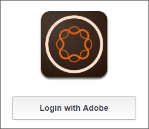
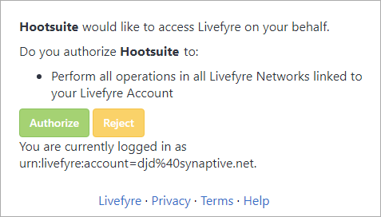
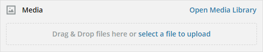

# Verwenden Sie Adobe Experience Manager Livefyre mit Hootsuite{#use-adobe-experience-manager-livefyre-with-hootsuite}

Erfahren Sie, wie Sie Experience Manager Livefyre mit Hootsuite verwenden, um benutzergenerierte Inhalte direkt über das Hootsuite-Dashboard zu kuratieren, zu verwalten und freizugeben.

## Verwenden Sie Adobe Experience Manager Livefyre mit Hootsuite {#topic_FB6E613DBCF74F39ABD5045C501EA326}

Erfahren Sie, wie Sie Experience Manager Livefyre mit Hootsuite verwenden, um benutzergenerierte Inhalte direkt über das Hootsuite-Dashboard zu kuratieren, zu verwalten und freizugeben.

## Erste Schritte {#task_22699BD901C24384AB2DC02D926D8F4A}

Kontext der Aufgabe

1. Installieren Sie Adobe Experience Manager Livefyre für Hootsuite aus dem Hootsuite-App-Verzeichnis.

1. Klicken Sie im Dashboard Ihrer Hootsuite auf **Mit Adobe** anmelden.

   

1. Melden Sie sich mit Ihren Livefyre-Anmeldeinformationen bei Experience Manager Livefyre an.
1. Klicken Sie auf **Autorisieren**, um Hootsuite Zugriff auf Ihre Bibliotheken zu gewähren.

   

   Nachdem Sie die Berechtigung erteilt haben, werden Sie zum Dashboard Hootsuite zurückgeleitet, wo Sie nach Assets in Ihren Experience Manager Livefyre-Bibliotheken suchen können.

## Suche nach Assets {#task_0B011B0C539E400BB72A6DF69FBF66C0}

Kontext der Aufgabe

1. Klicken Sie auf das Suchsymbol in der Menüleiste, um nach Assets in Ihren Experience Manager Livefyre-Bibliotheken zu suchen.

   

1. Klicken Sie auf **Wählen Sie** und ein Popup wird mit allen Ihren Bibliotheken angezeigt.
1. Klicken Sie auf den Ordner einer Bibliothek und dann auf **Ordner** auswählen, um die Bibliothek auszuwählen, die im Host-Stream angezeigt wird.

   

## Filteroptionen {#concept_5D062A9CD61A4B2E90784E5AA31CB16D}

Sie können Ihre Suchergebnisse mithilfe der Abschnitte &quot;Assets anzeigen von&quot;, &quot;Rechte&quot;, &quot;Suchbegriffe&quot;und &quot;Tags&quot;filtern.

Die Filteroptionen umfassen:

| Abschnitt | Beschreibung |
|--- |--- |
| Assets anzeigen von | Wählen Sie die Ansicht von Assets aus &quot;Alle Quellen&quot;oder aus einer einzelnen Quelle aus. Beispiel: Instagram, Twitter, Facebook usw. |
| Rechte | Wählen Sie diese Option, um nur Assets mit einer bestimmten Einstellung für die Rechte Ansicht. |
| Keywords | Wählen Sie diese Option, um die Ergebnisse nach Suchbegriffen oder Tags zu filtern. Beim Filtern nach Suchbegriffen werden der Textinhalt eines Beitrags sowie der Autorenanzeigename und der Autorenname durchsucht. |
| Tags | Wählen Sie diese Option, um die Ergebnisse nach Suchbegriffen oder Tags zu filtern. Beim Filtern nach Suchbegriffen werden der Textinhalt eines Beitrags sowie der Autorenanzeigename und der Autorenname durchsucht. |

Nachdem Sie die Suchparameter ausgewählt haben, werden Ihre Assets im Stream angezeigt, wenn Sie Folgendes durchsuchen:

### Stream-Menüoptionen

Wenn Sie auf den Namen oder das Symbol des Benutzers klicken, wird der Benutzer im entsprechenden Netzwerk angezeigt. Wenn Sie auf die Zeit klicken, wird der ursprüngliche Artikel angezeigt. Wenn Sie den Mauszeiger über dem Element halten, werden weitere Optionen angezeigt. Klicken Sie auf Freigeben 

-Symbol wird das aktuelle Asset zum Feld &quot;Netzwerkkomposition&quot;hinzugefügt, sodass Sie es über die Hootsuite für Ihre Netzwerke freigeben können.

>[!NOTE]
>
>Die Schaltfläche &quot;Freigeben&quot;wird nur angezeigt, wenn Sie nach Assets mit zugewiesenen Rechten filtern.

Klicken Sie auf das Symbol  zuweisen, um das aktuelle Element einem Ihrer Hootsuite-Teammitglieder zuzuweisen. Wenn ein Element bereits zugewiesen wurde, wird die Option  auflösen

wird angezeigt. Klicken Sie darauf, um die aktuelle Zuweisung zu lösen.

### Andere App-Menüs

Klicken Sie auf die Einstellungen 

können Sie das aktuelle Experience Manager-Livefyre-Konto trennen und eine Verbindung zu einem anderen Konto herstellen.

Klicken auf das Menü 

zeigt Links zu diesem Dokument, Support und Synaptive-Website an.

## Experience Manager Livefyre App Plugin {#task_33C8CEF4F5E44830B970BB3A7AAA2AA6}

Sie können Ihre Asset-Bibliotheken nicht nur in einem Hootsuite-Stream anzeigen, sondern auch Elemente aus Instagram-, Twitter-, Facebook- und YouTube-Streams in Ihren Livefyre-Experience Manager speichern.

1. Klicken Sie auf das Menüsymbol, das sich am unteren Rand jedes Elements befindet.

   

1. Wählen Sie **An AEM Livefyre** senden.
1. Wählen Sie eine oder mehrere Bibliotheken aus, in denen das Asset gespeichert werden soll.

   

1. Klicken Sie auf **In Bibliothek speichern** und das Element wird in den ausgewählten Bibliotheken gespeichert.

## Experience Manager Livefyre Media Library Component {#task_9CA2D5D49F8E463F9EF475BC09C8ACC9}

Sie können auf Ihre Assets über die Media-Komponenten von Hootsuite Composer zugreifen.

1. Klicken Sie im Composer auf den Link **Medienbibliothek öffnen** im Abschnitt **Medien**.

   

1. Wählen Sie Adobe Experience Manager Livefyre aus dem Dropdown-Menü und Ihre Dateien werden angezeigt.

   

1. Um dem aktuellen Beitrag, den Sie gerade schreiben, ein Asset hinzuzufügen, klicken Sie darauf. Um nach einem bestimmten Asset zu suchen, geben Sie die Suchbegriffe in das Feld **Medien suchen** ein und die Ergebnisse werden angezeigt.
