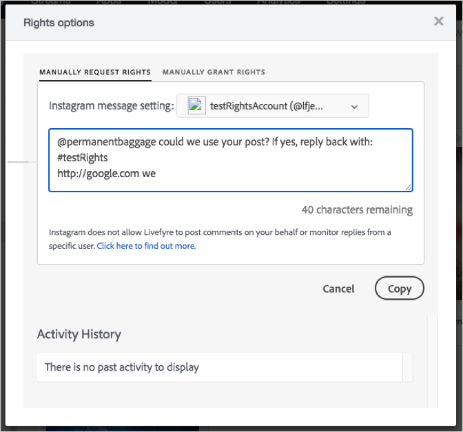

# 24. Mai 2018{#may}

Versionshinweise für die Version vom 24. Mai 2018.

## Neue Funktionen

**Instagram Rights Requests, Update Part 1.**

Die Möglichkeit, Berechtigungsanfragen in Instagram von Livefyre zu senden, ist aufgrund einer Instagram API-Änderung nicht verfügbar. Livefyre hat eine manuelle Problemumgehung zum Senden von Berechtigungsanforderungen durch Benutzer erstellt. Die Möglichkeit zum manuellen Senden von Berechtigungsanforderungen mit dieser Methode ist in App Content, der Bibliothek, aber nicht ModQ verfügbar (wird in einer zukünftigen Version bereitgestellt):

1. Öffnen Sie ein Asset, das Sie aus einem Instagram-Beitrag erhalten haben.
1. Öffnen Sie das Dialogfeld &quot;Rights Request&quot;.

   Das Dialogfeld wird mit dem Text für die Berechtigungsanforderung angezeigt.

1. Klicken Sie auf die Schaltfläche &quot;Kopieren&quot;, um den Text im Feld in die Zwischenablage zu kopieren.

   

   Livefyre kopiert automatisch den Text aus dem Feld in die Zwischenablage und zeigt eine Meldung an, in der bestätigt wird, dass Sie den Text kopiert haben.

1. Klicken Sie auf den Link in der Bestätigungsmeldung, um den Beitrag zu öffnen, der das Asset enthält, für das Sie Rechte anfordern.

   

   Livefyre öffnet den Beitrag in Instagram.

1. Fügen Sie den Text für die Anforderung kopierter Rechte in den Instagram-Beitrag auf Instagram ein.
1. Überwachen Sie den Beitrag auf die Antwort.
1. Wenn der Instagram-Benutzer Rechte gewährt, können Sie die Rechte in Livefyre manuell erteilen.

>[!NOTE]
>
>Am 14. Juni 2018 wird eine nahtlosere Problemumgehung eingeführt (Teil 2). Weitere Informationen finden Sie unter [Mitteilungen](/help/using/c-anouncements.md#c_anouncements).

## Probleme

Die Probleme in den folgenden Tabellen wurden in dieser Version behoben.

## Produktionsversion

| **Art des Problems** | **Komponente** | **Versionshinweise** |
|---|---|---|
| Fehler | Studio | Es wurde ein Problem behoben, bei dem Updates für Facebooks APIs dazu führten, dass einige Medien nicht korrekt angezeigt wurden. |

## UAT-Version

Es gibt keine UAT Versionshinweise für diese Version.
