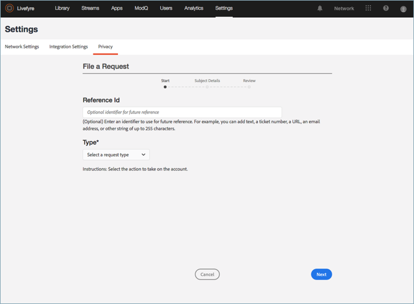

# Erstellen einer Datenschutzanforderung{#create-a-privacy-request}

Erstellen Sie eine Datenschutzanforderung in Livefyre.

Löschen Sie alle Daten für einen Benutzer, erstellen Sie einen Bericht aller Daten für einen Benutzer und nehmen Sie Änderungen an Opt-in- oder Opt-out-Änderungen vor.

Suchen und Suchen eines Benutzers und Erstellen eines Berichts mit ihrem Inhalt:

1. Wechseln **[!UICONTROL Settings > Privacy]**Sie zu und klicken **[!UICONTROL Create Request]**Sie dann auf.

   

1. Füllen Sie die Informationen im **[!UICONTROL Submit Request]** Fenster aus:

   * **[!UICONTROL Reference Id]**. Geben Sie einen Bezeichner ein, der für die künftige Referenz verwendet werden soll. Sie können beispielsweise Text, eine Ticket-Nummer, eine URL, eine E-Email-Adresse oder eine andere Zeichenfolge mit bis zu 255 Zeichen hinzufügen.
   * **[!UICONTROL Type]**

      * **Zugriff**. Sammelt alle mit dem Konto verknüpften Daten. Sensible Details, z. B. Kennwörter oder soziale Berechtigungen, werden verschleiert oder ausgelassen.

      * **Delete**. Celetes oder verschleiert alle mit dem Konto verknüpften Daten. **Wenn Sie diese Option wählen und auf "Senden" klicken, können Sie diese Aktion nicht rückgängig machen oder abbrechen sowie *gelöschte Daten wiederherstellen.*** Wenn das Konto einem Livefyre Studio-Benutzer angehört, bleiben einige Daten erhalten, um die Integrität Ihrer Geschäftsdatensätze aufrechtzuerhalten.

         >[!IMPORTANT]
         >
         >Durch das Löschen von Daten für ein Konto werden mit dem Konto verbundene Daten endgültig gelöscht oder gelöscht. Sie können diese Aktion weder rückgängig machen noch Daten wiederherstellen, nachdem Sie sie gelöscht haben.

      * **Ausschluss**. Verhindert, dass Livefyre Daten oder Inhalte aus einem Social-Konto über Streams oder Social Search passiver erfassen kann. Opt-in und Opt-out gelten nicht für registrierte Benutzer
      * **Teilnahme**. Aktivieren Sie Livefyre, um Daten oder Inhalte aus einem Social-Konto, das zuvor durch Streams oder Social Search abgemeldet wurde, passiver erfassen zu können. Opt-in und Opt-out gelten nicht für registrierte Benutzer
      

   * **[!UICONTROL Identifier Type]** und **[!UICONTROL Identifier]**

      * **[!UICONTROL User Account]**

         * Identifiziert ein Konto eines registrierten Benutzers durch die Benutzerkonto-ID, die durch Ihre User Management-ID oder die Studio-Benutzer-ID von Livefyre generiert wurde. Sie können die Benutzerkonto-ID auch in Benutzerdetails für den Benutzer in **den Livefyre****-Benutzereinstellungen** oder in den Details des Inhalts in der **Asset-Bibliothek** oder in **der App-Inhalte suchen.**

         * Zulässige Werte: Alphanumerische Zeichenfolge bis zu 255 Zeichen. Eine E-Mail-Adresse ist keine gültige Eingabe.
      * **[!UICONTROL Facebook User]**

         * Identifiziert ein Konto anhand einer von Facebook bereitgestellten numerischen ID. Der Anforderer sollte dies angeben. Anweisungen zur Suche nach der nummerischen Facebook-ID [finden Sie hier](https://www.facebook.com/help/1397933243846983?helpref=faq_content)
         * Zulässige Werte: 6-16 Numerische Zeichen
      * **[!UICONTROL Instagram User]**

         * Identifiziert das Konto anhand einer von Instagram bereitgestellten numerischen ID. Der Anforderer sollte dies angeben. Sie finden Anweisungen dazu, wie Sie die numerische Instagram-ID für ein Instagram-Konto finden, indem Sie nach online suchen.
         * Zulässige Werte: 5-16 Numerische Zeichen
      * **[!UICONTROL Twitter User]**

         * Identifiziert ein Konto anhand einer von Twitter bereitgestellten numerischen ID. Die Person, die die Datenschutzänderung anfordert, sollte dies angeben. Sie finden Anweisungen dazu, wie Sie die numerische Twitter-ID für ein Twitter-Konto finden, indem Sie auf online suchen.
         * Zulässige Werte: 5-16 Numerische Zeichen
      * **[!UICONTROL YouTube User]**

         * Identifiziert ein Konto anhand einer von youtube bereitgestellten numerischen ID. Die Person, die die Datenschutzänderung anfordert, sollte dies angeben. Anweisungen zur Suche nach der nummerischen youtube-ID finden [Sie hier](https://support.google.com/youtube/answer/3250431?hl=en)
         * Zulässige Werte: 5-16 Numerische Zeichen
      * **[!UICONTROL Generic Author]**

         * Identifiziert ein Konto durch eine Livefyre-Autor-ID (JID). Verwenden Sie diese Option für Inhalte, die über RSS, Tumblr oder urls bezogen werden. Um diese ID zu suchen, suchen Sie nach Inhalten, die dem Autor in der **App-Inhalts** - oder **Asset-Bibliothek**zugewiesen sind, und wählen Sie dann ein Element aus. Die ID ist unter ******"Info** «oder in der **Asset-Bibliothek** unter **" Autor** «im Abschnitt **"Details"** verfügbar.

         * Zulässige Werte: Alphanumerische Zeichenfolge bis zu 255 Zeichen
         

1. Klicken **[!UICONTROL Finish]**Sie auf.

   

1. (Nur für Löschanforderungen) Bestätigen Sie, dass Sie alle Informationen für den Benutzer löschen möchten.

   >[!IMPORTANT]
   >
   >Durch das Löschen von Daten für ein Konto werden mit dem Konto verbundene Daten endgültig gelöscht oder gelöscht. Sie können diese Aktion weder rückgängig machen noch Daten wiederherstellen, nachdem Sie sie gelöscht haben.

