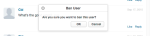
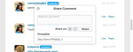
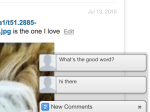

# Strings lokalisieren{#localize-strings}

Anpassen der Zeichenfolgen der Livefyre-Apps.

Die Textzeichenfolgen für die meisten HTML-Elemente in einer Livefyre-App können angepasst werden. Dies bietet die Flexibilität, den Text von gerenderten HTML-Elementen wie &quot;Posten als&quot;, &quot;Kommentar-Zähler&quot;oder &quot;Anmelden&quot;in eine beliebige gültige UTF-8-Zeichenfolge zu ändern. Verwenden Sie diese Funktion, um Ihrer Implementierung des Streams Persönlichkeit hinzuzufügen oder um die Sprache in der App für Ihre Benutzerbasis zu lokalisieren.

* Kommentare, Chat und Live-Blog

   * [Implementierung](#c-localize-strings/section_im4_224_xz)
   * [Kontozugriff](#c-localize-strings/section_cm3_d24_xz)
   * [Stream-Info](#c-localize-strings/section_wx1_c24_xz)
   * [Stream-Sortierung](#c-localize-strings/section_ih2_124_xz)
   * [Inhaltsinformationen](#c-localize-strings/section_llv_yd4_xz)
   * [Dargebotener Inhalt](#c-localize-strings/section_gmw_vd4_xz)
   * [Texteditor](#c-localize-strings/section_ky5_td4_xz)
   * [Antwortoptionen](#c-localize-strings/section_zvt_qd4_xz)
   * [Kommentar-Notifizierer](#c-localize-strings/section_qqt_pd4_xz)
   * [Fehlermeldungen](#c-localize-strings/section_omz_jxn_xz)

* [Uhrzeit- und Datumsformat](#c-localize-strings/section_yz4_g5n_xz)
* [Medienwall](#c-localize-strings/section_vwt_d5n_xz)
* [Landkarte](#c-localize-strings/section_fxv_c5n_xz)
* [Mosaik](#c-localize-strings/section_e2s_b5n_xz)
* [Karussell](#c-localize-strings/section_l2z_hkn_xz)
* [Funktionskarte](#c-localize-strings/section_mw2_hkn_xz)
* [Umfrage](#c-localize-strings/section_pdg_fwh_xz)
* [Livefyre-Identität](#c-localize-strings/section_zc3_xvh_xz)
* Mehr:
   * [Textzeichenfolgen überprüfen](/help/using/c-settings-other/c-translation-sets/c-review-text-strings.md#c_review_text_strings)
   * [Sir](/help/using/c-settings-other/c-translation-sets/c-sidenotes-text-strings.md#c_sidenotes_text_strings)

## Implementierung {#section_im4_224_xz}

Übergeben Sie zur Implementierung dieser Funktion eine 1-1-Objektzuordnung der Zeichenfolgen, die Sie überschreiben möchten, an das JavaScript-Konfigurationsobjekt. Wenn Sie kein Feld angeben, wird der Standardtext verwendet.

Beispiel:

```
var customStrings = {     
   postAsButton: "New Post As Text",     
   postEditButton: "New Post Edit Text"  
};   
   convConfig["strings"] = customStrings; fyre.conv.load(     
   networkConfig,     
   [convConfig],     
   function(){}  
);
```

Auf dieser Seite werden alle Textzeichenfolgen Liste, die für die Livefyre-Core-Apps angepasst werden können.

## Kontozugriff {#section_cm3_d24_xz}

Für den Authentifizierungsprozess verfügbare Zeichenfolgen und in den authentifizierten Benutzermenüs.


| Element | Schlüssel | Standardtext |
|---|---|---|
|  | displayName | %s |
|  | editProfile | Profil bearbeiten |
|  | notificationSettings | Benachrichtigungseinstellungen |
|  | siteAdmin | Admin Console (Links zu Studio) |
|  | signOut | Abmelden |

## Stream-Info {#section_wx1_c24_xz}

Für Informationen und Anzeigen von Inhaltsströmen verfügbare Zeichenfolgen. Liste der Anzahl der Personen, die zuhören, der Anzahl der Beiträge für die App und Ermöglicht Benutzern die Anmeldung oder den Zugriff auf ihre Kontoinformationen.

| Schlüssel | Standardtext | Stream-Daten |
|---|---|---|
|  | commentCountLabelZero | %s Kommentar |
|  | commentCountLabel | %s Kommentar |
|  | commentCountLabelPlural | %s Kommentare |
|  | listenerCount | Person hört |
|  | listenerCountPlural | zuhörende Personen |
|  | liveblogPostCountLabelZero | nach |
|  | liveblogPostCountLabel | nach |
|  | liveblogPostCountLabelPlural | Beiträge |
| Thread-Optionen | threadBreakoutButton | Gesamten Thread anzeigen |
|  | toswitchCollapse | Reduzieren umschalten |
| Kommentare mit hoher Geschwindigkeit/Warteschlange | aktualisieren | Aktualisieren |
|  | newComment | Neuer Kommentar |
|  | newComments | Neue Kommentare |
|  | newReply | neue Antwort |
|  | newReplies | neue Antworten |

## Stream-Sortierung {#section_ih2_124_xz}

Ermöglicht es Benutzern, zurückgegebene Inhalte nach Alter oder Popularität zu sortieren.


| Schlüssel | Standardtext | Kopfzeilenoptionen |
|---|---|---|
|  | sortNewest | Neueste |
|  | sortOldest | Älteste |
|  | sortTopComments | Wichtigste Kommentare |
|  | sortHotThreads | Hotkeys |
|  | sortSeparator |  |  |
|  | streamSorting | Wird geladen |
|  | topCommentsContentNotFoundMsg | Es gibt noch nicht genug &quot;Gefällt mir&quot;-Klicks. |
|  | hotThreadsContentNotFoundMsg | Es sind noch nicht genügend Threads vorhanden. |
|  | streamRefreshMsg | Erfahren Sie mehr über die neuen Funktionen. |
| Fußzeilenoptionen | archiveHeaderTitle | Aus dem Archiv |
|  | archiveShowMore | Mehr anzeigen |
|  | showMore | Weitere Kommentare anzeigen |
|  | showMoreLiveblog | Mehr Beiträge anzeigen |


## Content Info {#section_llv_yd4_xz}

Listen veröffentlichen Informationen: Benutzername, alle angewendeten Benutzer-Tags und die Uhrzeit des Beitrags.

  

| Schlüssel | Standardtext | Autor |
|---|---|---|
|  | moderator | moderator |
|  | hovercardViewProfile | Ansicht Profil |
| Beitragsinformationen | timeJustNow | gerade jetzt |
|  | timeMinutesAgo | Vor  Minute |
|  | timeMinutesAgoPlural | vor ... Minuten |
|  | timeHoursAgo | Stunde vor |
|  | timeHoursAgoPlural | vor ... Stunden |
|  | timeDaysAgo | ago |
|  | timeDaysAgoPlural | vor ... Tagen |
|  | likesPlural | „Gefällt mir“-Klicks |
|  | likesSingular | Gefällt mir |
|  | moderatorEditTimestamp | Von einem Moderator bearbeitet |
|  | commentTombstone | Dieser Kommentar wurde gelöscht |
|  | permalinkNotFoundMsg | Dieser Kommentar ist nicht mehr sichtbar. |
|  | quickProfileTooltip | Quick Profil |

## Vorgestellte Inhalte {#section_gmw_vd4_xz}

Wenn aktiviert, werden spezielle Inhalte oben im Stream aufgeführt.

|  | Schlüssel | Standardtext |
|---|---|---|
| Ausgewählte Bezeichnungen |  |  |
|  | specialCommentsTag | Vorgestellt |
|  | specialCommentsTitlePlural | Vorgestellte Kommentare |

## Texteditor {#section_ky5_td4_xz}

Standardmäßig ist sie für alle Benutzer am oberen Rand der Seite verfügbar.


|  | Schlüssel | Standardtext |
|---|---|---| 
| Editor-Schaltflächen | follow | + Folgen |
|  | unfollow | - Nicht befolgen |
|  | liveblogFollow | Live-Blog |
|  | liveblogUnfollow | Live-Blog nicht befolgen |
|  | postButton(Verfügbar für angemeldete Benutzer.) | Kommentar posten |
|  | postAsButton(Verfügbar für nicht authentifizierte Benutzer.) | Kommentar posten als... |
|  | postEditButton | Kommentar bearbeiten |
|  | postEditAsButton | Kommentar bearbeiten als... |
|  | postEditCancelButton | Abbrechen |
|  | editorDisabled | Dieses Gespräch ist derzeit für neue Kommentare geschlossen. |
| Chat-Optionen | livechatPostButtonLabel | Posten |
|  | livechatPostEditButton | Vorlage      |
|  | livechatWindowsInstruction | Drücken Sie Strg+Eingabetaste zum Posten |
|  | livechatOtherInstruction | Drücken Sie Befehl+Eingabetaste zum Posten |

## Antwortoptionen {#section_zvt_qd4_xz}

Sofern nicht anders angegeben, steht allen angemeldeten Benutzern zur Verfügung. Bewegen Sie den Mauszeiger über ein Inhaltsbedienfeld, um darauf zuzugreifen.



| Schlüssel | Standardtext |  |
|---|---|---|
| Benutzerreaktionsoptionen | Verfügbar für Endbenutzer. |  |
| FlagButton | Markierung |
|  | FlagCommentTooltip | Markierung |
|  | editButton(Nur für Autoren und Moderatoren verfügbar, falls aktiviert.) | Vorlage      |
|  | deleteButton(Nur für Autoren und Moderatoren verfügbar, falls aktiviert.) | Löschen |
|  | deleteCommentTooltip | Löschen |
|  | shareButton | Freigabe |
|  | shareCommentTooltip | Freigabe |
|  | likeButton | Gefällt mir |
|  | unlikeButton | Gefällt mir nicht |
|  | responseButton | Antwort |
|  | responseButtonSingular(Verfügbar für Chat und Live Blog.) | Antwort |
|  | responseButtonPlural(Verfügbar für Chat und Live-Blog) | Antworten |


| Schlüssel | Standardtext |  |
|---|---|---|
| Flag Modal | FlagTitle | Kommentar %s markieren |
|  | flagSubtitle | Markierung als |
|  | FlagDefaultSelectOption | Auswählen |
|  | FlagSpam | Spam |
|  | FlagSpamButton | Spam |
|  | FlagSpamCommentTooltip | Spam |
|  | flagOffensive | Offensive |
|  | flagOffensiveButton | Offensive |
|  | flagOffensiveCommentTooltip | Offensive |
|  | FlagDismatch | widersprechen |
|  | FlagDismatchButton | widersprechen |
|  | FlagDismatchCommentTooltip | widersprechen |
|  | FlagOffTopic | Off-Thema |
|  | FlagOfftopicButton | Off-Thema |
|  | FlagOfftopicCommentTooltip | Off-Thema |
|  | FlagEmail | E-Mail |
|  | FlagEmailPlaceholder | you@example.com |
|  | flagNotes | Hinweise |
|  | FlagNotesPlaceholder | Beginn hier eingeben... |
|  | FlagConfirmButton |  OK- |
|  | FlagCancelButton | Abbrechen |
|  | flagConfirmationMessage | Kennzeichnen Sie %s Kommentar als %s? |
|  | FlagSuccessMsg | Kommentar wurde markiert. |


| Schlüssel | Standardtext |  |
|---|---|---|
| Share Modal | shareTitle | Kommentar freigeben |
|  | sharePlaceholderText | Was denkst du? |
|  | shareLabel | Freigeben auf: |
|  | shareTextTwitter | leer gelassen |
|  | shareTextFacebook | leer gelassen |
|  | shareTextLinkedin | leer gelassen |
|  | shareButtonText | Freigabe |
|  | sharePermalink | Permalink |
|  | loadingPermalink | Kurze URL wird geladen... |
|  | shareText | Ich habe gerade einen Kommentar gepostet. Schau es dir an! |



| Schlüssel | Standardtext |  |
|---|---|---|
| Antwort Modal | postReplyAsButton | Kommentar posten als... |
|  | postReplyButton(Verfügbar für angemeldete Benutzer.) | Kommentar posten |
|  | backToHotThreads | Zurück zu Hot Threads |


| Schlüssel | Standardtext |  |
|---|---|---|
| Twitter @mension modal | ErwähnungTitle | Erwähnung freigeben |
|  | ErwähnungUntertitelTwitter | Tweet freigeben für: |
|  | ErwähnungDefaultText | Ich habe Sie in einem Livefyre Kommentar erwähnt! |
|  | ErwähnungConfirmButton |  OK- |
|  | ErwähnungCancelButton | Abbrechen |
|  | ErwähnungErrorGeneral | Ups! Etwas ist schiefgelaufen! Livefyre wurde berichtet. |
|  | ErwähnungErrorNoneSelected | Sie müssen mindestens eine Erwähnung aktiviert haben. |
|  | ErwähnungMenuTitle | So sehen Sie Ihre Freunde |
|  | ErwähnungTwitterConnect | Verbindung zu Twitter |
|  | ErwähnungTwitterFetching | Freunde werden abgerufen... |
|  | ErwähnungErfolgMsg | Erwähnungen wurden erfolgreich gesendet. |


| Schlüssel | Standardtext |  |
|---|---|---|
| Modal bearbeiten | Verfügbar für Studio-Administratoren, Benutzermanager oder Moderatoren |  |
| @(@Erwähnung.) | &lt;/>(Öffnet das benutzerdefinierte HTML-Fenster.) |  |
|  | customHtmlDialogTitle(Wird als Header für das Modal angezeigt.) | hinzufügen benutzerdefinierter HTML |


| Schlüssel | Standardtext |  |
|---|---|---|
| Optionen für Moderationsantworten | Verfügbar für Studio-Administratoren, Benutzermanager oder Moderatoren. |  |
| pendingComment | pending |
|  | banUserButton | Benutzer sperren |
|  | banUserTooltip | Benutzer sperren |
|  | bozoButton | Bozo |
|  | bozoCommentTooltip | Bozo |
|  | featureButton | Funktion |
|  | featureCommentTooltip | Funktion |
|  | unfeatureButton | Rückgängig |
|  | specialCommentTooltip | Rückgängig |


| Schlüssel | Standardtext |  |
|---|---|---|
| Benutzermodal verbieten | Verfügbar für Studio-Administratoren, Benutzermanager oder Moderatoren. |  |
| banTitle | Benutzer sperren |  |
|  | banConfirmation | Sind Sie sicher, dass dieser Benutzer verboten werden soll? |
|  | banConfirmButton |  OK- |
|  | banCancelButton | Abbrechen |

## Kommentar-Notifizierer {#section_qqt_pd4_xz}

Sofern aktiviert, verfügbar am unteren Rand der Seite für alle Livefyre-Konversations-Apps.



|  | Schlüssel | Standardtext |
|---|---|---|
| Benachrichtigungsbeschriftungen | commentNotifier | Neuer Kommentar |
|  | commentNotifierPlural | Neue Kommentare |
|  | liveblogNotifier | Neuer Beitrag |
|  | liveblogNotifierPlural | Neue Posts  |

## Fehlermeldungen {#section_omz_jxn_xz}

Für anpassbare Fehlermeldungen verfügbare Zeichenfolgen.

| Schlüssel | Standardtext |
|---|---|
| errorAuthError | Sie sind nicht berechtigt, einen Kommentar zu dieser Unterhaltung zu posten |
| errorCommentsNotAllowed | Kommentare sind in dieser Unterhaltung nicht zulässig |
| errorDefault | Es ist ein Fehler aufgetreten. Bitte versuchen Sie es erneut. |
| errorDuplicate | So sehr Sie Ihren Kommentar mögen, können Sie ihn nicht zweimal posten. |
| errorEditDuplicate | Sie müssen den Text des Kommentars ändern, wenn Sie ihn bearbeiten. |
| errorEditNotAllowed | Sie dürfen keine Kommentare zu dieser Unterhaltung bearbeiten. |
| errorEditTimeExceeded | Ihre Kommentarbearbeitungszeit ist leider abgelaufen. |
| errorEmpty | Es scheint, dass Sie versuchen, einen leeren Kommentar zu posten. |
| errorExpired | Ihre Sitzung ist abgelaufen. Bitte laden Sie die Seite neu. |
| errorFlagNotSelected | Bitte wählen Sie einen Markentyp aus. |
| errorGuestLiked | Es tut uns leid, nur die mit Konten können Inhalte mögen. |
| errorInhinreichendPermissions | Unzureichende Berechtigungen |
| errorInvalidChar | Es scheint, dass Sie versuchen, ein ungültiges Zeichen zu posten. |
| errorLikeOwnComment | Du kannst deinen eigenen Kommentar nicht mögen |
| errorMalforming | Sie versuchen anscheinend, fehlerhafte Inhalte zu posten. |
| errorMaxChars | Entschuldige! Dein Kommentar ist zu lang. Bearbeiten Sie die Datei und versuchen Sie es erneut. |
| errorMediaNotAvailable | Medien sind nicht mehr sichtbar. |
| errorShowMore | Beim Laden weiterer Kommentare ist ein Fehler aufgetreten. |
| MultipleMediaNotAllowedError | Mit Ihren Berechtigungen erhalten Sie jeweils nur eine Medienanlage. |

## Uhrzeit- und Datumsformat {#section_yz4_g5n_xz}

Übersetzen und anpassen Sie, wie Datumsangaben auf Inhaltskarten in Visualisierungs-Apps angezeigt werden.

| Schlüssel | Standardtext |
|---|---|
| hourAgo | {number}h |
| daysAgoSingular | {number}h |
| justNow | 1 s |
| minutesAgo | {number}m |
| minutesAgoSingular | {number}m |
| monthDayFormat | {day} {monthAbbrev} |
| monthDayYearFormat | {day} {monthAbbrev} {year} |
| monthNames | Januar, Februar, März, April, Mai, Juni, Juli, August, September, Oktober, November, Dezember |
| monthNamesAbbrev | Januar, Februar, März, April, Mai, Juni, Juli, August, September, Oktober, November, Dezember |
| secondsAgo | {number} |
| secondsAgoSingular | {number} |

## Medienwall {#section_vwt_d5n_xz}

Für die Medienwall-App verfügbare Zeichenfolgen.

| Schlüssel | Standardtext |
|---|---|
| specialText | Vorgestellt |
| shareButtonText | Freigabe |

| Schlüssel | Standardtext |
|---|---|
| postButtonText | Was hast du im Kopf? |
| postModalTitle | Kommentar posten |
| postModalButton | Kommentar posten |
| postModalPlaceholder | Was möchten Sie sagen? |
| showMoreButtonText | Mehr laden |
| shareButtonText | Freigabe |

## Landkarte {#section_fxv_c5n_xz}

Für Karten verfügbare Zeichenfolgen.

| Schlüssel | Standardtext |
|---|---|
| specialText | Vorgestellt |
| shareButtonText | Freigabe |

## Mosaic {#section_e2s_b5n_xz}

Für Mosaics verfügbare Zeichenfolgen.

| Schlüssel | Standardtext |
|---|---|
| specialText | Vorgestellt |
| shareButtonText | Freigabe |

## Karussell {#section_l2z_hkn_xz}

Zeichenfolgen für Karussell verfügbar.

| Schlüssel | Standardtext |
|---|---|
| specialText | Vorgestellt |
| shareButtonText | Freigabe |

## Funktionskarte {#section_mw2_hkn_xz}

Für die Funktionskarte verfügbare Zeichenfolgen.

| Schlüssel | Standardtext |
|---|---|
| specialText | Vorgestellt |
| shareButtonText | Freigabe |

## App hochladen {#section_grc_gkn_xz}

Für die Upload-App verfügbare Zeichenfolgen.

| Schlüssel | Standardtext |
|---|---|
| postButtonText | Was hast du im Kopf? |
| postModalTitle | Kommentar posten |
| postModalButton | Kommentar posten |
| postModalTitlePlaceholder | Titel eingeben |
| postModalPlaceholder | Was möchten Sie sagen? |
| postModalConfirationTitle | Vielen Dank für Ihre Veröffentlichung! |
| postModalConfirmationMessage | Ihr Beitrag wird geprüft. |
| postModalConfirmationButton | Fertig |
| title |  |
| message |  |
| editorErrorAttachmentsRequired | Eine Anlage ist erforderlich |
| editorErrorBody | Bitte eine Nachricht hinzufügen |
| editorErrorDuplicate | So sehr Sie Ihre Notiz mögen, Sie können sie nicht zweimal posten |
| editorErrorGeneric | Es ist ein Fehler aufgetreten |
| editorErrorTitleRequired | Ein Titel ist erforderlich |

## Umfrage {#section_pdg_fwh_xz}

Für Umfragen verfügbare Zeichenfolgen.

| Schlüssel | Standardtext |
|---|---|
| totalVotesLabel | %s Gesamtstimmen |
| shareStringText | Ich habe gerade über %s abgestimmt, was ist Ihre Stimme? |
| pollClosedLabel | Diese Umfrage ist zurzeit geschlossen |

## Livefyre-Identität {#section_zc3_xvh_xz}

Für Livefyre Identity verfügbare Zeichenfolgen.

| Schlüssel | Standardtext |
|--- |--- |
| autoFollowConversations | Konversationen, an denen ich teilnehme, automatisch ausführen |
| back | Zurück |
| bio | Biographie |
| erstellen | Erstellung     |
| createANewAccount | Neues Konto erstellen |
| createNewAccountWithEmail | Neues Konto mit E-Mail erstellen |
| changeAvatar | Avatar ändern |
| selectFile | Datei wählen |
| completeAccount | Vollständiges Konto |
| emailWhenAnyReplies | E-Mail, wenn jemand auf mich antwortet |
| emailCommentsIFollow | E-Mail-Kommentare in Konversationen, die ich befolge |
| emailSenttoResetPassword | E-Mail gesendet! Überprüfen Sie Ihren Posteingang auf einen Link, um Ihr Kennwort zurückzusetzen. |
| emailVerificationSent | E-Mail-Bestätigung gesendet |
| firstName | Vorname |
| forgotPassword | Kennwort vergessen? |
| forgotYourPassword | Haben Sie Ihr Kennwort vergessen? |
| forgotYourPasswordInstructions | Geben Sie unten Ihren Benutzernamen oder Ihre E-Mail-Adresse ein und wir senden Ihnen einen Link, um Ihr Passwort zu ändern. |
| formInputCloseButtonText | Close |
| formInputCancelButtonText | Abbrechen |
| formInputSaveButtonText | Speichern |
| hasNotLeftAnyComments | hat keine Kommentare hinterlassen |
| locationIsFrom | ist von |
| labelAvatar | Avatar |
| labelComments | Kommentare |
| labelConfirmNewPassword | Neues Kennwort bestätigen |
| labelConfirmPassword | Passwort bestätigen |
| labelEmail | Email Address |
| labelLikes | „Gefällt mir“-Klicks |
| labelLoading | Wird geladen |
| labelNewPassword | Neues Kennwort |
| labelNotification | Benachrichtigungen |
| labelPassword | Passwort |
| labelProfile | Profil |
| labelUsername | Benutzername |
| labelUsernameOrEmail | Benutzername oder E-Mail |
| lastName | Nachname |
| livefyreAccount | Livefyre-Konto |
| Position | Position |
| loadingProfile | Profil wird geladen |
| newPassword | Neues Kennwort |
| oldPassword | Altes Kennwort |
| on | on |
| oder | oder |
| passwordLinkExpired | Der Link, auf den Sie zum Zurücksetzen des Kennworts geklickt haben, ist abgelaufen. Setzen Sie Ihr Kennwort erneut zurück, und wir senden Ihnen einen neuen Link zu. |
| angenehecheckEmailToComplete | Bitte überprüfen Sie Ihre E-Mail, um Ihre Registrierung abzuschließen. |
| hat Folgendes gepostet | Gepostet |
| poweredBy | powered by |
| profileNotificationImmediate | immediate |
| profileNotificationHourly | pro Stunde |
| profileNotificationNiemals | never |
| previousComments | Letzte Kommentare |
| zurücksetzen | Reset |
| resetPassword | Kennwort zurücksetzen |
| signIn | Anmelden |
| signInWith | Anmelden mit |
| signInWithEmail | Anmelden mit E-Mail |
| signUp | Anmelden |
| socialAccount | Social-Konto |
| successPasswordChanged | Erfolg! Ihr Kennwort wurde geändert und Sie sind jetzt angemeldet |
| termsAndConditions | Geschäftsbedingungen |
| termsAndConditionsIntro | Durch die Anmeldung akzeptieren Sie die Variable |
| termsOfUse | Nutzungsbedingungen |
| termsOfUseIntro | Durch die Anmeldung stimmen Sie zu, |
| thisUser | Dieser Benutzer |
| verifyPassword | Kennwort bestätigen |
| fileSizeLimit | max. 2 MB |
| accountnotfound | Konto nicht gefunden |
| avatarImageExceedSize | Ihr Avatar-Bild überschreitet die Dateigrenze von 2 MB |
| fieldisrequired | Feld akzeptiert nur eine Ganzzahl |
| fieldonlyaccept tsavalidemail | Feld akzeptiert nur eine gültige E-Mail |
| fieldonlyaccept letters | Feld akzeptiert nur Buchstaben |
| filesizemustbelessthanMB | Die Dateigröße muss kleiner als {#}MB sein. |
| invalidusernameorpassword | Ungültiger Benutzername oder ungültiges Kennwort |
| minimumlengthFlags | Mindestlänge von {#}-Zeichen |
| maximumholthofcharacters | Maximale Länge von {#} Zeichen |
| therewasanerror | Es ist ein Fehler aufgetreten |
| thisFieldDisrequired | Dieses Feld ist ein Pflichtfeld. |
| validfileextensions | Gültige Dateierweiterungen |
| valueCustomMatch | Wert muss übereinstimmen |
| passwordLength | 6 bis 32 Zeichen lang sein. |
| passwordCharacters | sowohl Groß- als auch Kleinbuchstaben einschließen. |
| passwordSymbols | muss mindestens eine Zahl und ein Symbol enthalten. |
| passwordUsername | enthält nicht Ihren Benutzernamen. |
| passwordPopoverTitle | Ihr Kennwort muss: |
| passwordErrorContainsFirstName | Das von Ihnen eingegebene Passwort enthält entweder Ihren Benutzernamen, Vornamen oder Nachnamen. Geben Sie aus Sicherheitsgründen ein Kennwort ein, das Ihren Benutzernamen, Vornamen oder Nachnamen nicht enthält. Bitte beachten Sie auch, dass Ihr Passwort Folgendes enthalten muss: 6 bis 32 Zeichen Ein Großbuchstabe A Kleinbuchstabe A Symbol |
| passwordErrorContainsLastName | Das von Ihnen eingegebene Passwort enthält entweder Ihren Benutzernamen, Vornamen oder Nachnamen. Geben Sie aus Sicherheitsgründen ein Kennwort ein, das Ihren Benutzernamen, Vornamen oder Nachnamen nicht enthält. Bitte beachten Sie auch, dass Ihr Passwort Folgendes enthalten muss: 6 bis 32 Zeichen Ein Großbuchstabe A Kleinbuchstabe A Symbol |
| passwordErrorContainsUsername | Das von Ihnen eingegebene Passwort enthält entweder Ihren Benutzernamen, Vornamen oder Nachnamen. Geben Sie aus Sicherheitsgründen ein Kennwort ein, das Ihren Benutzernamen, Vornamen oder Nachnamen nicht enthält. Bitte beachten Sie auch, dass Ihr Passwort Folgendes enthalten muss: 6 bis 32 Zeichen Ein Großbuchstabe A Kleinbuchstabe A Symbol |
| passwordErrorTooShort | Mindestens 6 Zeichen für ein Kennwort |
| passwordErrorTooLong | Maximal 32 Zeichen für Kennwort |
| passwordErrorMissingUppercase | Das Kennwort sollte mindestens ein Großbuchstaben enthalten |
| passwordErrorMissingLowercase | Kennwort sollte mindestens ein Kleinbuchstabe enthalten |
| passwordErrorMissingSymbol | Das Kennwort sollte mindestens ein Symbol im Satz `!@#$%^&*()?.,<>\’;:”[]{}|` enthalten. |


