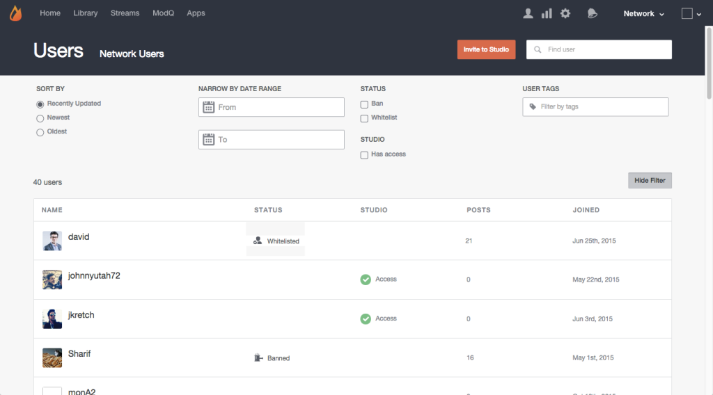

# Suchen nach Benutzern{#search-for-users}

Verwenden Sie das Suchfeld oben auf der Seite, um nach dem Anzeigenamen, der Benutzer-ID, der E-Mail-Adresse oder dem Datum, an dem sie in Ihr Livefyre-Netzwerk eingetreten sind, nach Site-Besuchern zu suchen.

>[!NOTE]
>
>Diese Felder unterstützen die Platzhaltersuche.

1. Klicken Sie auf **[!UICONTROL Show Filter]**, um ein Bedienfeld zu öffnen, aus dem aufgelistete Benutzer gefiltert werden können.
1. **[!UICONTROL Sort by]** Aktualisierungen der aufgelisteten Benutzerkonten: Kürzlich aktualisiert, Neueste oder Älteste.
1. **[!UICONTROL Narrow by Date Range]** nur Benutzerkonten Liste, die während des Eingabebereichs hinzugefügt wurden.
1. Nur **[!UICONTROL Banned]**- oder **[!UICONTROL Whitelisted]**-Liste.
1. Nur **[!UICONTROL Studio]**-Listen.
1. Liste nur dieser Konten mit der Eingabe **[!UICONTROL User Tags]** angehängt. 
